# Mardown
Hola mundo esto es un curso de Markdown

en Mardown para dar salto de linea debemos hacer 2 Enter

<!-- Títulos -->
## Título2
### Título3
#### Título4
##### Título5
###### Título6
<!-- Texto negrita - Strong -->

Para escribir **negrita** usamos doble * al inicializar y al finalizar la palabra

También para __negrita__ podemos usar _ dos guiones bajos

<!-- Texto Italic -->

Para escribir *texto en Italic* usamos un * al comienzo y al final del texto

También podemos usar _para escribir en Italic_ un _ guion bajo al inicio y al final del texto

<!-- Texto negrita y curvada a la vez -->

Para hacer ***texto negrita y curvado a la vez*** usamos tanto al inicio como al final *** tres asteriscos

<!-- Texto tachado -->

Para ~~tachar texto~~ usamos tanto al inicio como al final del texto ~~ doble Tilde

<!-- Cita -->
Para usar una cita antes de la cita ponemos >

>A la vista de suficientes ojos, todos los errores resultan evidentes --Linus Torvalds

<!-- Para usar código --->

Para usar una línea de código empezamos y finalizamos con: 

`
console.log("Hola mundo");
`

También podemos usar tres ~

~~~
print ("Hello word");
~~~

También para un bloque de código usamos:

```xml
<key>NSHealthShareUsageDescription</key>
<string>La app necesita acceso a tus pasos para mostrar la actividad.</string>
<key>NSLocationWhenInUseUsageDescription</key>
<string>Se usa para registrar tus recorridos.</string>
<key>NSLocationAlwaysUsageDescription</key>
<string>Se usa para registrar el recorrido incluso en segundo plano.</string>
<key>UIBackgroundModes</key>
<array>
    <string>location</string>
    <string>audio</string>
</array>
```

<!-- Lista desordenada -->
Para las listas desordenadas podemos usar tanto el - guion como el asterisco *

- Manzana
- Pera
* Pantalones
* Camisas

También se puede usar el símbolo de +

+ Azucar
+ Aceite
+ Vinagre

Para añadir sublistas hacemos una tabulación

* Desayuno
    * Zumo naranja
    * Huevos
    * Fruta
* Comida
    * Pasta
    * Pescado
    * Fruta
* Cena
    * Sopa
        * de marisco
        * de pollo

<!-- Listas ordenadas -->

### Asignaturas
1. Programación
2. Base de datos
3. Sistemas
    1. cmd
    2. linux
    3. redes
        * practica
        * teoria

<!-- Creación de Links -->

Curso que estamos siguiendo [curso](https://tutorialmarkdown.com/markdown "Tutorial Markdown")

<pepolink@gmail.com>

También podemos usar <> para url aunque no es recomendable

<https://tutorialmarkdown.com/markdown>

También los links los podemos poner en negrita abriendo y cerrando con doble *

Visita la web de **[apple](https://www.apple.com/es/ "Web de apple")**

Con 3 * tenemos combinación de inclinado y negrita

Visita la web de ***[apple](https://www.apple.com/es/ "Web de apple")***

Para hacer una referencia:

Esto es una referencia [1]

[1]: https://www.apple.com/es/ 

<!-- Imágenes y Badges -->

Esta es la sintaxis para crear agregar una imagen en el lenguaje de marcas Markdown


Tambien podemos mostrar imágenes que se encuentran en local en este caso en nuestra carpeta Curso-Markdown2

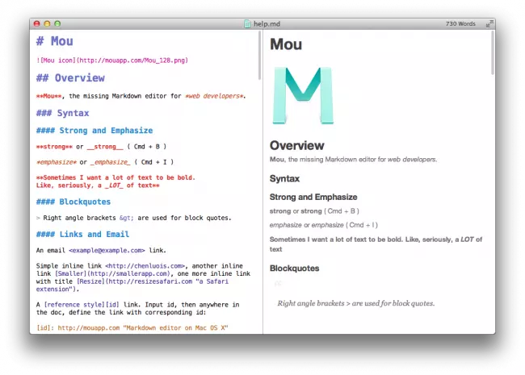

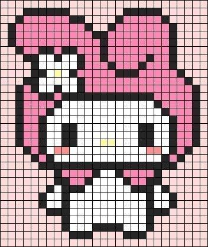

Para adjuntar badges consigo las url de
<https://github.com/henriquesebastiao/badges?tab=readme-ov-file>


GitHub Profile Badges

<https://home.aveek.io/GitHub-Profile-Badges/>


Top 5 badges para GitHub

<https://www.makeuseof.com/badges-that-will-supercharge-your-github-repository/>

[](https://github.com/anuraghazra/github-readme-stats)


<!-- Reglas y emojis -->

Para poner una regla o linea de separación podemos poner 3 *
***
Tambien se puede hacer con 3 guiones

---
Para poder ver los emojis instalamos en Visual Studio Code la extensión github markdown preview

<https://gist.github.com/rxaviers/7360908>

:heart: :smirk: :frog:

:dog: :tiger:

:pig:

<!-- Tablas -->

| Distribuciones | Disponible | Version |
|----------------|------------|---------|
| ArchLinux      | Yes        | 1.0.1   |
| KaliLinux      | **No**     | 2.5     |
| Ubuntu         | Yes        | 25.7    |

También podemos generar tablas desde esta web
<https://www.tablesgenerator.com/markdown_tables>

| Distros   | Disponible | Versión | Año de publicación |
|-----------|------------|---------|--------------------|
| ArchLinux |     Yes    |   1.1   |        2020        |
| KaliLinux |   **No**   |   12.5  |        2021        |
| Ubuntu    |     Yes    |   25.7  |        2025        |


<!-- Combinar Markdown y HTML -->

### Combinación Markdown y HTML

<h3>  Código html</h3>


En html podemos modificar el tamaño de la imagen


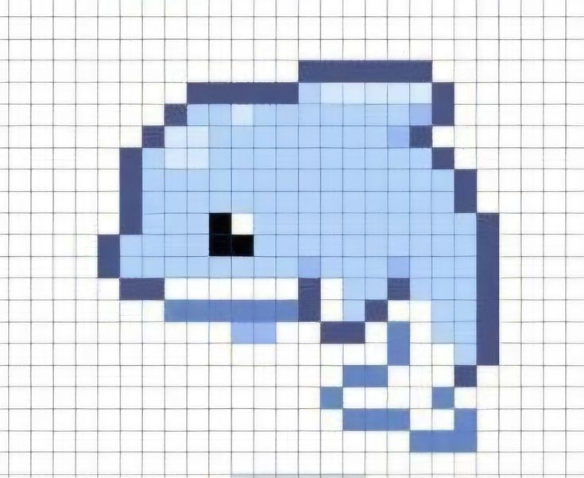


<!-- Videos -->


[](https://www.youtube.com/watch?v=LE0VkWstzhQ)


[](https://www.youtube.com/watch?v=8mKf9rjvjv8)

Para una resolucion máspequeña quitamos el maxresdefaut por hqdefault 

[](https://www.youtube.com/watch?v=LE0VkWstzhQ)


<!-- Hacks de Texto -->

Vamos usar html:

<ins> Texto subrayado </ins>

<center> Texto alineado al centro </center>


Podemos hacer una combinación de ambas

<center><ins>Texto alineado al centro y subrayado </ins></center>


<p style=color:red> Texto de color rojo </p>

<p style=color:blue><ins>Texto de color azul con subrayado</ins></p>

<p style=color:green> Texto de color verder </p>

<a href="https://github.com/jcqa24" target="_blank"> Perfil de Github </a>

<!-- Diagramas flujo  horizontal-->

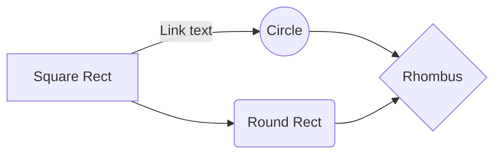


<!-- Diagramas flujo vertical -->


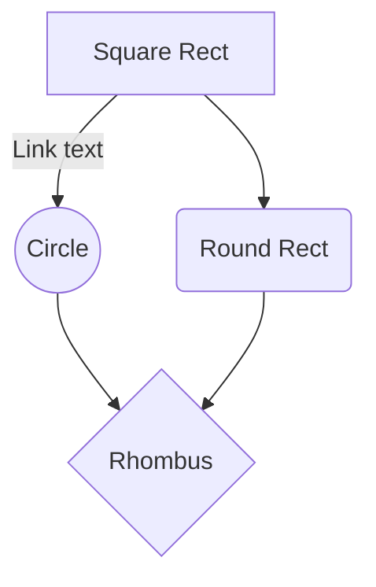

<!-- Diagrama flujo personalizado -->


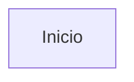

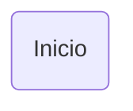

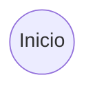
<!-- Ejemplo digrama flujo -->

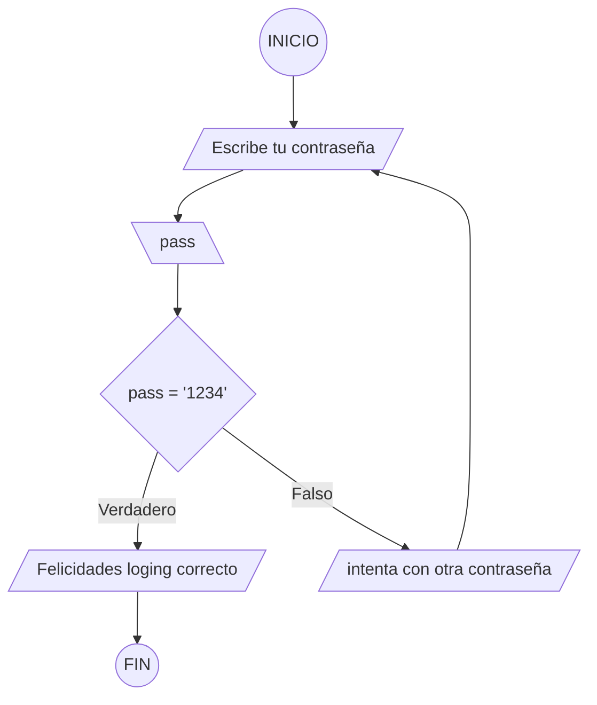

<!--Diagrama de clases -->

Ponemos la clase Animal y los atributos->  con el + hacemos que sea pública, un tipo de dato entero que se llame edad y otro de tipo String
Para los métodos indicamos de nuevo nuestra clase Animal ->el + para indicar que es público y usamos () -> si queremos dentro de los() añadimos un parámetro
También entre clases podemos hacer una relación de herencia entre la clase padre y las otras clases
También podemos representar dependencia entre clases
También podemos representar la composición

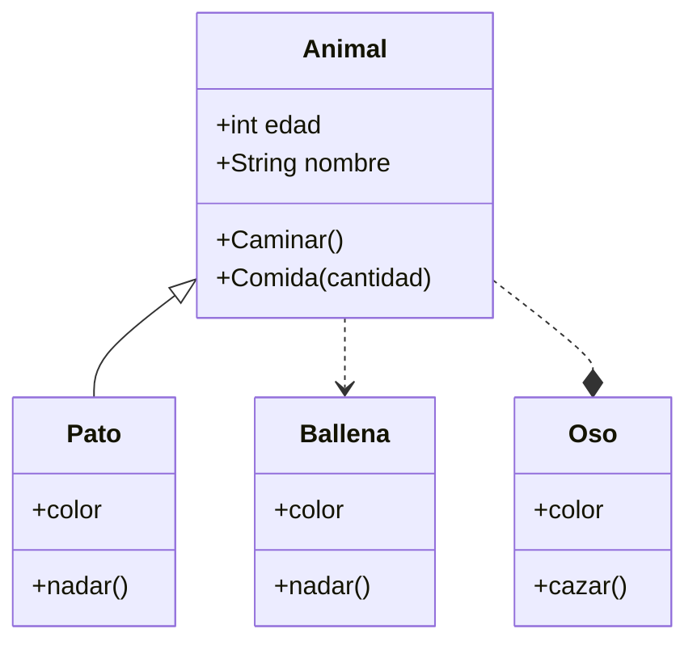

<!--Diagramas de secuencia -->

Vamos ahora a realizar un diagrama de secuencia
Las peticiones sincronas son líneas continuas
Las oeticiones asincronas (linea punteada)

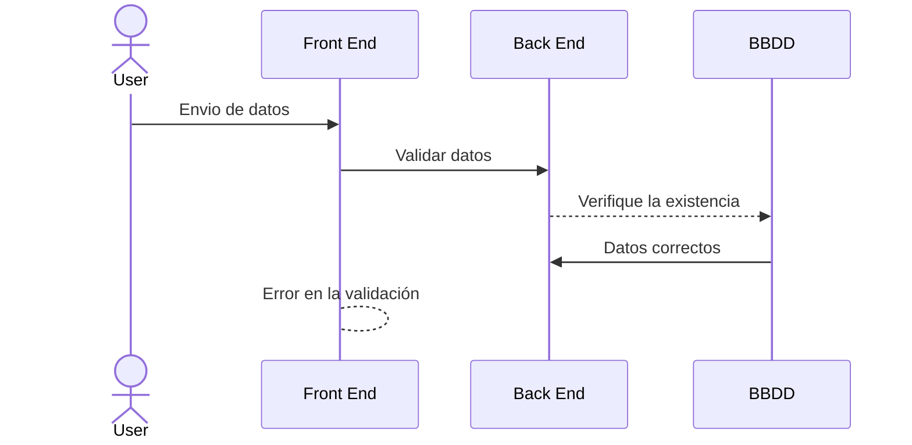
<!-- Gráficas circulares -->

Creación de gráficas circulares

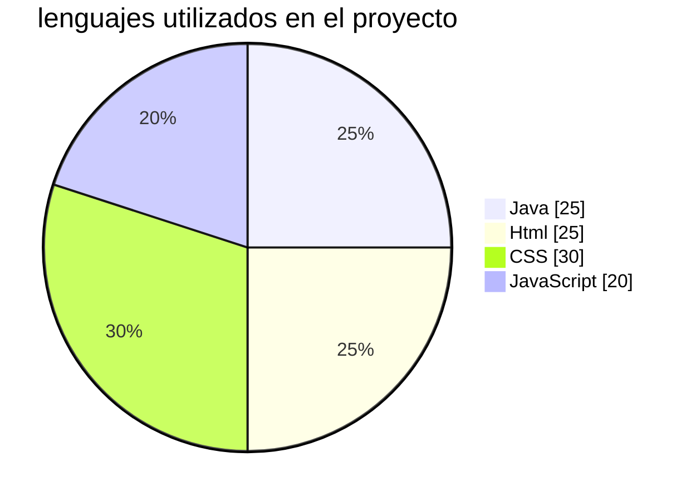


<!-- Crear diagrama Entidad Relación -->

Creación diagrama Entidad Relación
Usuario únicamente existe uno y solo uno ||
Usuario realiza 0 compras (pedidos) o varias o{
En un pedido debe tener almenos 1 producto o muchos }| o{

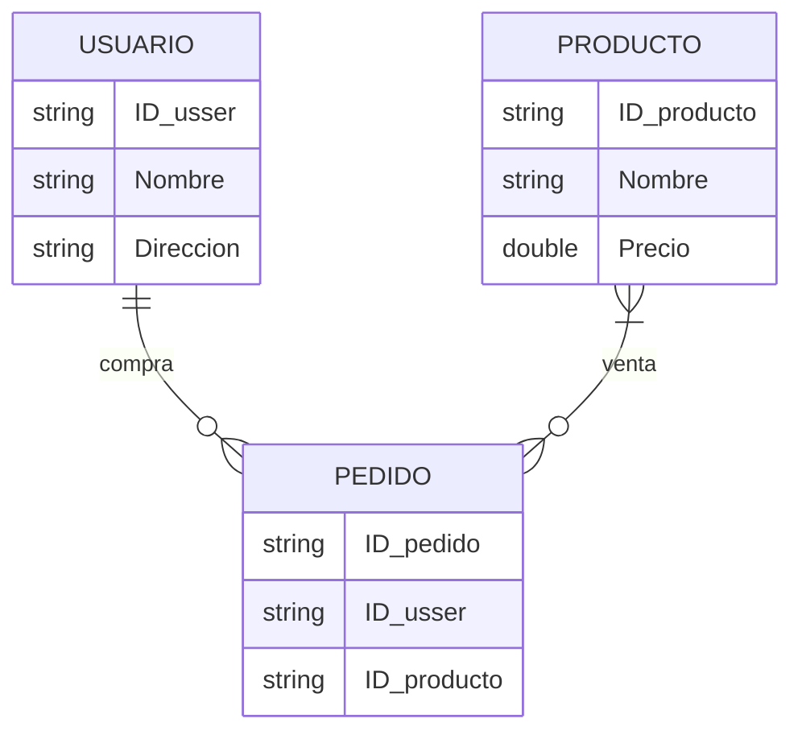

<!-- Diagrama Journey -->

Creación Diagramas Journey

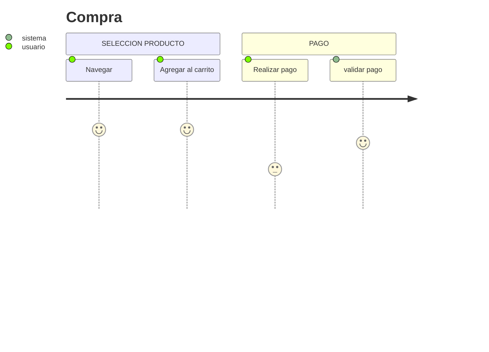
Vamos a Realizar un diagrama Git
<!-- Diagramas Git -->

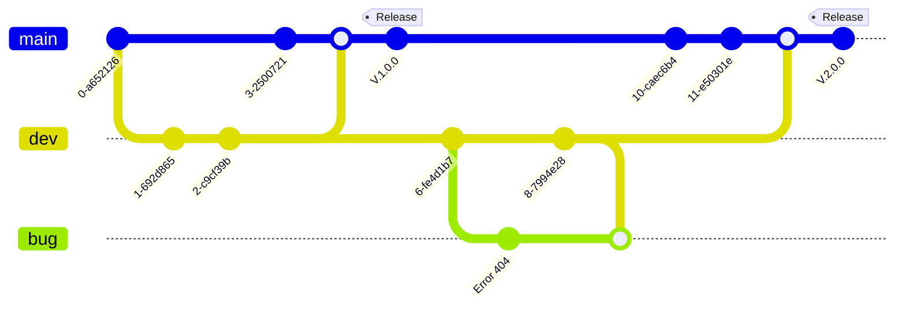

Vamos a realizar un diagrama Gantt
<!-- Diagramas Gantt -->

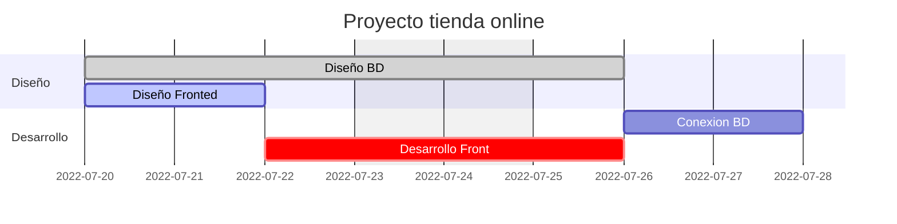
<!-- Diagramas de Requerimiento -->

Vamos a crear un diagrama de requerimiento

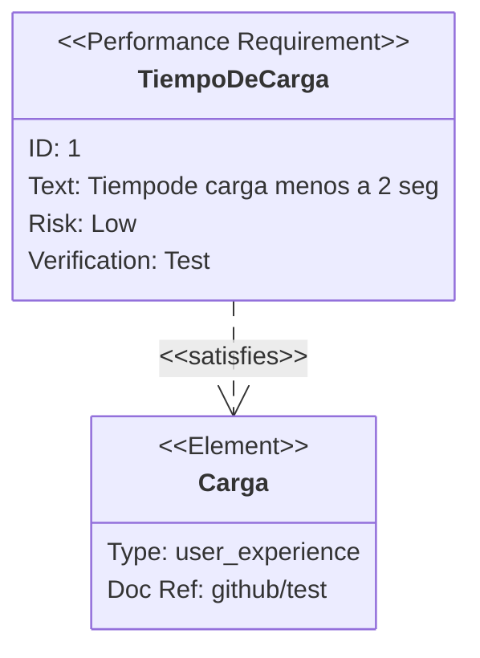


<!-- Añadir ecuaciones -->

Vamos añadir ecuaciones usando Latex

$$ x^2 + y^2 = z^n $$

$$ \int_{0}^{10}\pi\frac{3}{4\beta} $$


